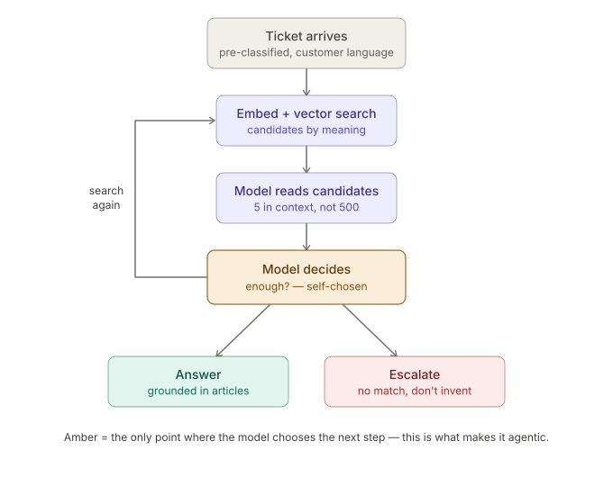

# NordTor Knowledge Agent

An agentic technical-support assistant that helps service technicians find the right repair instructions in seconds, in the language they actually use, not the error codes buried in the manuals.

> **Status:** Work in progress. Sections marked _TBD_ are pending the evaluation and instrumentation phases. Numbers will be added once they are measured, not before.

---

## What it does

When a fault report comes in from a customer in everyday language ("the door makes a grinding noise and stops halfway"), the agent searches an internal knowledge base written in technician language ("error code E-204: roller wear on the upper guide rail"), decides on its own whether it has found a genuine match, and either returns a grounded repair instruction or honestly escalates when no article covers the case, instead of inventing an answer.

**A note on language:** The knowledge-base articles and the test tickets are written in **German**, because the customer is a German manufacturer with German technicians and German customers. The language gap the agent has to bridge is *within* German (technician wording vs. customer wording), which is the realistic and harder case. All documentation, code, and commit messages are in **English** for portability.

---

## Who this is for

**Company:** A family-owned manufacturer of industrial and fire-rated door systems, ~600 employees across several DACH locations, with its own service hotline for fault reports.

**The pain:** Experienced technicians (the retiring generation) carry decades of diagnostic knowledge in their heads. As they leave, less experienced staff have to search scattered documentation and servers, which lengthens diagnosis time per fault report and raises the escalation rate.

**Primary buyer:** Head of Innovation / AI Lead, owns the internal champions program and has a direct line to leadership.
**Economic buyer:** C-level sponsor (Managing Director / CDO).
**Technical validator:** Head of IT / Lead Architect.

**Procurement objections & mitigations:** _TBD, to be filled with the data-governance and integration concerns this buyer profile typically raises._

---

## Architecture

The system is an **agent**, not a fixed workflow. The distinction matters: in a workflow, the developer fixes the sequence of steps in advance. Here, the model itself chooses the next step at runtime, based on what it reads in the retrieved articles.

The loop:

1. **Ticket arrives** (pre-classified, customer language). Upstream classification/scoring is assumed to have already happened.
2. **Embed + vector search**, the ticket is embedded and matched against the article index by *meaning*, not by keyword. This is what bridges the language gap.
3. **Model reads candidates**, the top candidates (not all articles) are placed in context. The model reads them.
4. **Model decides**, *the one agentic step.* The model judges for itself: is this enough? Then it either searches again, answers, or escalates.
5. **Answer** (grounded in the articles, with a cited source) **or escalate** (no match, does not invent).

### Deliberate scope boundaries

Three things are intentionally **out of scope**, each for a reason:

- **Upstream classification / scoring** is not built here. It is a deterministic pre-processing step demonstrated in a separate project; this build isolates the *agentic retrieval core* so the hard part stands alone.
- **Ingestion / source normalization** is assumed to have happened. Real knowledge bases are messy: PDFs, spreadsheets, ticket systems, tribal knowledge. In production, a prior pipeline extracts and normalizes those sources into clean text before anything is embedded. This build starts from normalized articles. Retrieval quality is ultimately bounded by ingestion quality; that layer is untested here.
- **Synthetic data only.** The articles and tickets are synthetic, by design, not scraped or real. Controlling the dataset is what makes the evaluation clean: the language gap is built in on purpose, and the deliberately uncovered cases are defined explicitly so escalation can be measured. Tickets are calibrated against real operator and layperson phrasing observed in public fault descriptions; raw commercial fault complaints are too sparse publicly to use as a dataset directly, so they inform the *language* of the synthetic tickets rather than serving as data. See `FAILURE_LOG.md` for the sourcing path.

---

## Cost & latency profile

_TBD, pending instrumentation. Will report cost per 1000 runs, p50/p95 latency, and which part of the call dominates the bill._

---

## Security / governance notes

A production deployment over a real, company-wide knowledge base would require **document-level access control**, role-based permissions and tiered access, so that users only retrieve from documents they are authorized to see. This is deliberately out of scope here: the build isolates the *retrieval and escalation mechanism*, and access control is a separate (and largely solved) infrastructure concern. Other governance points to detail: what data flows where, anonymization of any future real ticket data (non-trivial, re-identification risk), and what a DPO would object to.

---

## Evaluation results

The evaluation measures **two things separately**, and this separation is the core of the build:

- **Retrieval:** Does the agent find the correct article despite the language gap? (Baseline: naive keyword matching vs. the agent.)
- **Hallucination / honest escalation:** When no article covers the case, does the agent escalate, or does it invent a solution? This is the harder, agentic evaluation.

| Metric | Baseline (keyword) | Agent v1 | Agent v2 |
|---|---|---|---|
| Retrieval accuracy | _TBD_ | _TBD_ | _TBD_ |
| Correct escalation (uncovered cases) | _TBD_ | _TBD_ | _TBD_ |

> **Status of evaluation:** Initial single-ticket retrieval testing is complete; full quantitative scoring (Recall@3, MRR, baseline vs. system across all 28 gold-standard cases) is pending. Early finding: raw vector retrieval bridges the gap cleanly on high-signal cases (an acoustic symptom ticket retrieved the correct article at rank 1, score well above the field) but **fails on low-signal confusion cases**. For the sensor confusion pair, the correct article fell outside the top 5, with mechanical articles ranking above it. Diagnosis confirmed the articles are correctly embedded (querying with article-native vocabulary surfaces them at rank 1 to 2); the failure is specific to the customer-to-technician vocabulary gap when the distinguishing signal is a small part of an article that shares bulk vocabulary with wrong answers. See `FAILURE_LOG.md` (2026-06-02). This directly motivates the deferred retrieval layers below.

---

## Limitations

**Circular validation.** Tickets and articles are both synthetic and share an origin (both derive, via a neutral situations list, from the same author). The evaluation therefore measures the agent's ability to bridge a *language gap*, everyday wording vs. technical wording, under controlled conditions. It does **not** measure robustness to genuinely independent, real-world customer language, because no real, unseen distribution is involved. Generating tickets in a separate session (with no access to the articles) reduces lexical leakage, but does not remove this circularity.

This is a deliberate trade-off: synthetic data is what makes the ground truth clean and the two metrics (retrieval, escalation) measurable at all. Synthetic data validates the *mechanism*; production data validates *robustness*. These are two distinct validation stages, in that order. With real deployment data, the first validation step would be to replay actual (anonymized) customer tickets against the knowledge base and compare retrieval accuracy to this synthetic baseline.

---

## ROI math

All parameters below are **estimated / synthetic**, for illustration:

- ~40 fault reports/day x 9 min saved per report (12 to 3 min diagnosis) x 20 working days x €50/h ≈ **€6,000 / month** in diagnosis time alone.

**Honest caveat:** This figure measures *only* diagnosis time. It does **not** capture the larger, harder-to-quantify value: the senior capacity freed up for product work, and the knowledge retention itself.

**Payback period:** _TBD._

---

## What I would improve next

The retrieval finding above gives a concrete reason for the techniques deferred in `BREAK_HYPOTHESES.md`: **wider candidate retrieval** (the correct article fell outside the top 5, so any reranking or reasoning layer must see more candidates or it never gets the right answer to work with), **chunking** (so a distinguishing section becomes its own vector instead of being diluted in a whole-article average), and a **reranking or agentic reasoning step** over the wider candidate set.

Also on the list: the stopping condition (preventing the agent from looping too long or giving up too early), and stress-testing the ingestion assumption above.

---

## What this demonstrates

**As a résumé line:** _TBD._

**As a pre-sales pitch:** _TBD._

---

## Demo

_Loom link, TBD (recorded after v2)._